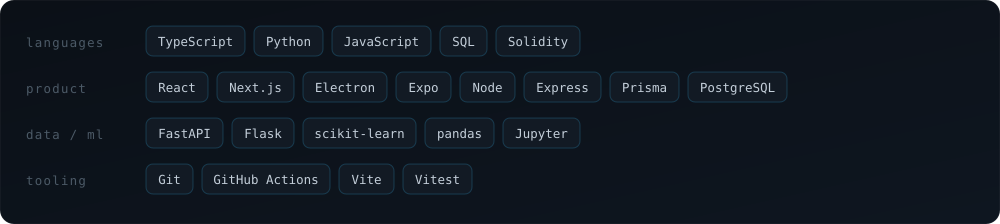

### whoami

I build things that have to work on the first run — compliance pipelines where a false negative is a fine, and scheduling software where a bad export means dead air at 6am.

Right now that's **CorridorComply**, a KYC/AML engine aimed at the remittance corridors the big vendors price out of reach, and **Radio**, a desktop app a station runs its daily playout schedule through.

[**Email**](mailto:zyadsalama14@gmail.com) &nbsp;·&nbsp; [**LinkedIn**](https://linkedin.com/in/YOUR_HANDLE) &nbsp;·&nbsp; [**Portfolio**](https://github.com/Zezoo123/Portfolio)

### Selected work

<table>
<tr>
<td width="50%" valign="top">

**[CorridorComply](https://github.com/Zezoo123/CorridorComply)**
`python` `fastapi` `ocr`

Corridor-specific KYC, AML and sanctions screening for emerging-market payment flows — built around Qatar→Philippines and UAE→India. Open-core: the base engine is free, corridor logic is the paid tier.

</td>
<td width="50%" valign="top">

**[Radio](https://github.com/Zezoo123/Radio)**
`electron` `react` `typescript`

Turns Excel station grids into BSI Simian Pro playout logs — programs, audio elements, athan times, hourly markers. Windows installer built in CI, golden-file tests over the export format. In daily use, same-day feedback loop.

</td>
</tr>
<tr>
<td width="50%" valign="top">

**[DeFi Arbitrage & Prediction](https://github.com/Zezoo123/DeFi-Arbitrage-and-Prediction-Tool)**
`flask` `lstm` `scikit-learn`

Third-year project at Manchester. An LSTM price forecaster alongside an ISOMAP/UMAP + Random Forest / Gradient Boosting hybrid, feeding on-chain arbitrage detection.

</td>
<td width="50%" valign="top">

**[Handyman](https://github.com/Zezoo123/Handyman)**
`next.js` `expo` `prisma`

Home-services marketplace for Qatar. Monorepo: Express + TypeScript API, Next.js web, Expo React Native apps, PostgreSQL behind Prisma.

</td>
</tr>
</table>

<b>More</b>

 

- **[nlu_group1](https://github.com/Zezoo123/nlu_group1)** — natural language understanding group project, notebooks and experiments
- **[Portfolio](https://github.com/Zezoo123/Portfolio)** — personal site, designed and built from scratch
- **[application-manager](https://github.com/Zezoo123/application-manager)** — job application and offer tracker
- **[learn-solidity](https://github.com/Zezoo123/learn-solidity)** — smart contract practice, spun out of the DeFi work
- **[Reddit_brainrot](https://github.com/Zezoo123/Reddit_brainrot)** — Reddit API → short-form social posts

### Stack

### The numbers

<!--
  These four images come from free public services (github-readme-stats,
  streak-stats, activity-graph). They rate-limit and go down — when that
  happens you get a broken-image icon. Either self-host them (see SETUP.md)
  or delete this whole section; nothing else depends on it.
-->

<picture>
  <source media="(prefers-color-scheme: dark)" srcset="https://github-readme-stats.vercel.app/api?username=Zezoo123&show_icons=true&theme=tokyonight&hide_border=true&bg_color=00000000&icon_color=38bdf8&include_all_commits=true&count_private=true" />
  
</picture>
<picture>
  <source media="(prefers-color-scheme: dark)" srcset="https://github-readme-stats.vercel.app/api/top-langs/?username=Zezoo123&layout=compact&theme=tokyonight&hide_border=true&bg_color=00000000&langs_count=8" />
  
</picture>

<picture>
  <source media="(prefers-color-scheme: dark)" srcset="https://github-readme-activity-graph.vercel.app/graph?username=Zezoo123&theme=tokyo-night&hide_border=true&bg_color=00000000&color=38bdf8&line=38bdf8&point=ffffff&area=true" />
  
</picture>

<!-- Populated by .github/workflows/snake.yml — see SETUP.md. Delete if you skip the workflow. -->
<picture>
  <source media="(prefers-color-scheme: dark)" srcset="https://raw.githubusercontent.com/Zezoo123/Zezoo123/output/github-snake-dark.svg" />
  
</picture>

---

Open to backend, fintech and ML engineering roles.
