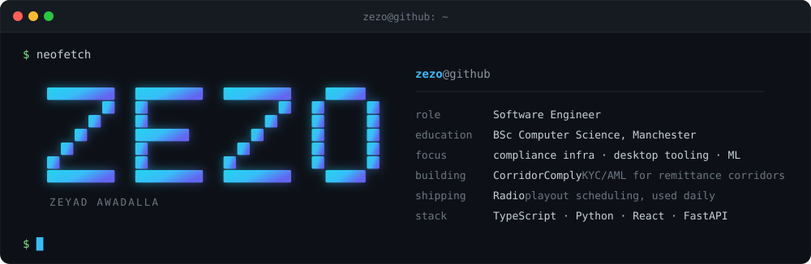
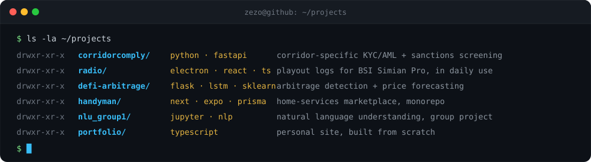

<div align="center">



[**email**](mailto:zyadsalama14@gmail.com) &nbsp;·&nbsp; [**linkedin**](https://linkedin.com/in/YOUR_HANDLE) &nbsp;·&nbsp; [**portfolio**](https://github.com/Zezoo123/Portfolio)

</div>

## `~/whoami`

I like problems where being wrong is expensive — a missed sanctions hit, or a playout log that leaves a station with dead air at 6am. Most of what I build ends up as infrastructure somebody depends on quietly.

## `~/projects`



| | | |
|---|---|---|
| **[CorridorComply](https://github.com/Zezoo123/CorridorComply)** | `python` `fastapi` `ocr` | Corridor-specific KYC, AML and sanctions screening for remittance, payroll and fintech flows — built around Qatar→Philippines and UAE→India. Open-core: base engine free, corridor logic paid. |
| **[Radio](https://github.com/Zezoo123/Radio)** | `electron` `react` `typescript` | Turns Excel station grids into BSI Simian Pro playout logs — programs, audio elements, athan times, hourly markers. Windows installer built in CI, golden-file tests over the export format. |
| **[DeFi Arbitrage & Prediction](https://github.com/Zezoo123/DeFi-Arbitrage-and-Prediction-Tool)** | `flask` `lstm` `sklearn` | Third-year project at Manchester. LSTM forecaster alongside an ISOMAP/UMAP + RF/GBR hybrid, feeding on-chain arbitrage detection. |
| **[Handyman](https://github.com/Zezoo123/Handyman)** | `next` `expo` `prisma` | Home-services marketplace for Qatar. Express + TypeScript API, Next.js web, Expo mobile apps, Postgres via Prisma. |

<details>
<summary><code>ls ~/projects/archive</code></summary>

<br/>

- **[nlu_group1](https://github.com/Zezoo123/nlu_group1)** — natural language understanding group project, notebooks and experiments
- **[Portfolio](https://github.com/Zezoo123/Portfolio)** — personal site, designed and built from scratch
- **[application-manager](https://github.com/Zezoo123/application-manager)** — job application and offer tracker
- **[learn-solidity](https://github.com/Zezoo123/learn-solidity)** — smart contract practice, spun out of the DeFi work
- **[Reddit_brainrot](https://github.com/Zezoo123/Reddit_brainrot)** — Reddit API → short-form social posts

</details>

## `~/stack`


## `~/stats`

<!--
  The only images here that aren't hosted in this repo. They come from free
  public services that rate-limit and go down — a broken icon means the host,
  not your repo. Self-host them (SETUP.md) or delete this whole section.
-->

<div align="center">

<picture>
  <source media="(prefers-color-scheme: dark)" srcset="https://github-readme-stats.vercel.app/api?username=Zezoo123&show_icons=true&theme=dark&hide_border=true&bg_color=00000000&title_color=58a6ff&icon_color=58a6ff&text_color=8b949e&include_all_commits=true&count_private=true" />
  
</picture>
<picture>
  <source media="(prefers-color-scheme: dark)" srcset="https://github-readme-stats.vercel.app/api/top-langs/?username=Zezoo123&layout=compact&theme=dark&hide_border=true&bg_color=00000000&title_color=58a6ff&text_color=8b949e&langs_count=8" />
  
</picture>

<!-- Populated by .github/workflows/snake.yml — see SETUP.md. Delete if you skip it. -->
<picture>
  <source media="(prefers-color-scheme: dark)" srcset="https://raw.githubusercontent.com/Zezoo123/Zezoo123/output/github-snake-dark.svg" />
  
</picture>

</div>

## `~/contact`

```console
$ mail -s "hello" zyadsalama14@gmail.com
$ open https://linkedin.com/in/YOUR_HANDLE
```

<sub>Open to backend, fintech and ML engineering roles.</sub>
